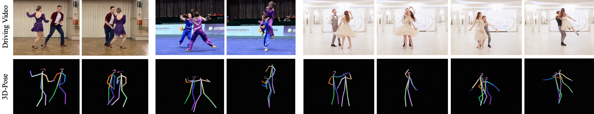
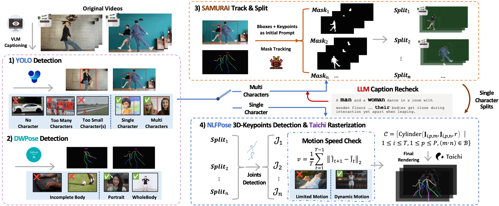

 <h1>Pose Extraction & Rendering Code for SCAIL: Towards Studio-Grade Character Animation via In-Context Learning of 3D-Consistent Pose Representations</h1>

This repository contains the 3D pose extraction & rendering code for **SCAIL (Studio-Grade Character Animation via
In-Context Learning)**, a framework that enables high-fidelity character animation under diverse and challenging
conditions, including large motion variations, stylized characters, and multi-character interactions.
<p align="center">
  
</p>


## 📋 Methods

When processing multi-person data, we segment each person, extract their poses, and then render them together to achieve multi-person pose extraction.
<p align="center">
  
</p>

Our multi-stage pose extraction pipeline provides robust estimations under multi-person interactions:
<p align="center">
  
</p>

By applying 3D pose instead of 2D key-point based methods, our model is able to recognize occlusion relationships and preserve motion characteristics during augmentation and retarget.
<p align="center">
  
</p>


## 📋 TODOs

- [x] **Inference Code for 3D Pose Extraction & Rendering**

- [x] **Inference Code for 3D Pose Retarget**

- [ ] **Inference Code for Multi-Human Pose Extraction & Rendering**

## 🚀 Getting Started

Make sure you have already clone the main repo, this repo should be cloned under the main repo folder:
```
SCAIL/
├── examples
├── sat
├── configs
├── ...
├── SCAIL-Pose
```

Change dir to this pose extraction & rendering folder:

```
cd SCAIL-Pose/
```

### Weights Download

Download Pretrained Weights for pose extraction & rendering. The script below
downloads [NLFPose](https://github.com/isarandi/nlf) (torchscript), [DWPose](https://github.com/IDEA-Research/DWPose) (
onnx) and [YOLOX](https://github.com/Megvii-BaseDetection/YOLOX) (onnx) weights. You can also download the weights
manually and put them into the `pretrained_weights` folder.

```
mkdir pretrained_weights && cd pretrained_weights
# download NLFPose Model Weights
wget https://github.com/isarandi/nlf/releases/download/v0.3.2/nlf_l_multi_0.3.2.torchscript
# download DWPose Model Weights & Detection Model Weights
mkdir DWPose
wget -O DWPose/dw-ll_ucoco_384.onnx \
  https://huggingface.co/yzd-v/DWPose/resolve/main/dw-ll_ucoco_384.onnx
wget -O DWPose/yolox_l.onnx \
  https://huggingface.co/yzd-v/DWPose/resolve/main/yolox_l.onnx
cd ..
```

The weights should be formatted as follows:

```
pretrained_weights/
├── nlf_l_multi_0.3.2.torchscript
└── DWPose/
    ├── dw-ll_ucoco_384.onnx
    └── yolox_l.onnx
```

### Environment Setup

We recommend using [openmmlab](https://github.com/open-mmlab) for the environment setup. 
The following commands are used  to create a conda environment and install the required packages. You can refer to the official
openmmlab [installation guide](https://mmpose.readthedocs.io/en/latest/installation.html) 
and [taichi-lang](https://www.taichi-lang.org) for more details. or using like:

```shell
conda activate openmmlab
pip install -r requirements.txt
```

## 🦾 Usage

Default Extraction & Rendering:

```
python NLFPoseExtract/process_pose.py --subdir <path_to_the_example_pair> --resolution [512, 896]
```

Extraction & Rendering using 3D Retarget:

```
python NLFPoseExtract/process_pose.py --subdir <path_to_the_example_pair> --use_align --resolution [512, 896]
```

Note that the examples are in the main repo folder, you can also use your own images or videos. After the extraction and rendering, the results will be saved in the example folder and you can continue to use that folder to generate character animations in the main repo.
