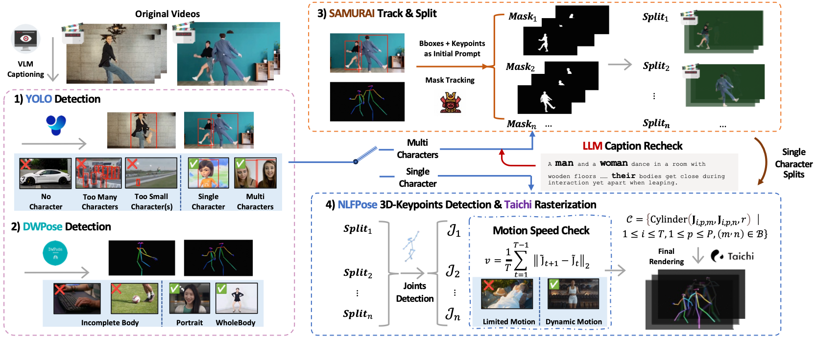

 <h1>Official Pose Extraction & Rendering Code for SCAIL and SCAIL-2</h1>
  <div align="center">
  <a href='https://arxiv.org/abs/2512.05905'></a>
  <a href='https://teal024.github.io/SCAIL/'></a>
  <a href="https://github.com/zai-org/SCAIL">
    
  </a>
</div>


This repository contains the 3D pose extraction & rendering code for **SCAIL** Series, a framework towards Studio-Grade Character Animation via In-Context Learning), enabling complex animation under diverse and challenging
conditions, including large motion variations and multi-character interactions. The main repo is at [zai-org/SCAIL](https://github.com/zai-org/SCAIL).
<p align="center">
  
</p>


## 📋 Methods
For SCAIL-Preview, a pose-driven animation framework. We develop the representation to be fully identity agnostic and depth-aware. We connect estimated 3D human keypoints according to skeletal topology and represent bones as spatial cylinders. The resulting 3D skeleton is rasterized into the frame space to obtain motion guidance signals.

To process multi-character data, we introduce a **segment-and-extract pipeline**, we first segment each character, then extract their poses, and finally render them together to achieve multi-character pose extraction. This yield more robust results than commonly used end-to-end multi-human motion recovery methods, benefiting from [NLFPose](https://github.com/isarandi/nlf)’s reliable depth estimation.

<p align="center">
  
</p>

<p align="center">
  
</p>

For SCAIL-2, we introduce end-to-end driving, which is designed to bypass the pose estimation to obtain more reliable and expressive motion. To unify character animation and character replacement, as well as binding motion to character under multi-interaction scenarios, we introduce In-Context Unified Mask mechanism, serving as explicit signals to tell the model which motion to learn, which character should get the transfered motion and finally, whether the original environment should work as a reference. We adopt [SAM3](https://github.com/facebookresearch/sam3) to extract the explicit mask for both the reference image and the driving sequence.

## 🗞️ Update and News
* 2026.5.7: We update the inference code to support SCAIL-2. SCAIL-1 inference code are now marked as `v1`.
* 2025.12.16: The pose extraction & rendering has also been partly adapted to ComfyUI in [ComfyUI-SCAIL-Pose](https://github.com/kijai/ComfyUI-SCAIL-Pose)!


## 📋 TODOs

- [x] **Inference Code for 3D Pose Extraction & Rendering**

- [x] **Inference Code for 3D Pose Retarget**

- [x] **Inference Code for Multi-Human Pose Extraction & Rendering**


## 🚀 Getting Started

Make sure you have already clone the main repo, this repo should be cloned under the main repo folder:
```
SCAIL/
├── examples
├── sat
├── configs
├── ...
├── SCAIL-Pose
```

Change dir to this pose extraction & rendering folder:

```
cd SCAIL-Pose/
```

### Environment Setup

We recommend using [mmpose](https://github.com/open-mmlab) for the environment setup. You can refer to the official
mmpose [installation guide](https://mmpose.readthedocs.io/en/latest/installation.html). Note that the example in the guide uses python 3.8, however we recommend using python>=3.10 for better compatibility with SAM models.
The following commands are used to install the required packages once you have setup the environment.

```bash
conda activate openmmlab
pip install -r requirements.txt

# [Optional] SAM2 is only for multi-human extraction of SCAIL-Preview, for SCAIL-2 we use SAM3
git clone https://github.com/facebookresearch/sam2.git && cd sam2
pip install -e .
cd checkpoints && \
./download_ckpts.sh && \
cd ../..
```


### Weights Download

First, download pretrained weights for pose extraction & rendering. The script below
downloads [NLFPose](https://github.com/isarandi/nlf) (torchscript), [DWPose](https://github.com/IDEA-Research/DWPose) (
onnx) and [YOLOX](https://github.com/Megvii-BaseDetection/YOLOX) (onnx) weights. You can also download the weights
manually and put them into the `pretrained_weights` folder.

```bash
mkdir pretrained_weights && cd pretrained_weights
# download NLFPose Model Weights
wget https://github.com/isarandi/nlf/releases/download/v0.3.2/nlf_l_multi_0.3.2.torchscript
# download DWPose Model Weights & Detection Model Weights
mkdir DWPose
wget -O DWPose/dw-ll_ucoco_384.onnx \
  https://huggingface.co/yzd-v/DWPose/resolve/main/dw-ll_ucoco_384.onnx
wget -O DWPose/yolox_l.onnx \
  https://huggingface.co/yzd-v/DWPose/resolve/main/yolox_l.onnx
cd ..
```

The weights should be formatted as follows:

```
pretrained_weights/
├── nlf_l_multi_0.3.2.torchscript
└── DWPose/
    ├── dw-ll_ucoco_384.onnx
    └── yolox_l.onnx
```


## 🦾 Usage

Default Extraction & Rendering for SCAIL-Preview:

```
# Single Character w/o 3D Retarget
python NLFPoseExtract/v1_process_pose.py --subdir <path_to_the_example_pair> --resolution [512, 896]

# Single Character w/ 3D Retarget
python NLFPoseExtract/v1_process_pose.py --subdir <path_to_the_example_pair> --use_align --resolution [512, 896]

# Multi-Human
python NLFPoseExtract/v1_process_pose_multi.py --subdir <path_to_the_example_pair> --resolution [512, 896]
```

Note that the examples are in the main repo folder, you can also use your own images or videos. After the extraction and rendering, the results will be saved in the example folder and you can continue to use that folder to generate character animations in the main repo.

## 📄 Citation

If you find this work useful in your research, please cite:

```bibtex
@article{yan2025scail,
  title={SCAIL: Towards Studio-Grade Character Animation via In-Context Learning of 3D-Consistent Pose Representations},
  author={Yan, Wenhao and Ye, Sheng and Yang, Zhuoyi and Teng, Jiayan and Dong, ZhenHui and Wen, Kairui and Gu, Xiaotao and Liu, Yong-Jin and Tang, Jie},
  journal={arXiv preprint arXiv:2512.05905},
  year={2025}
}
```
