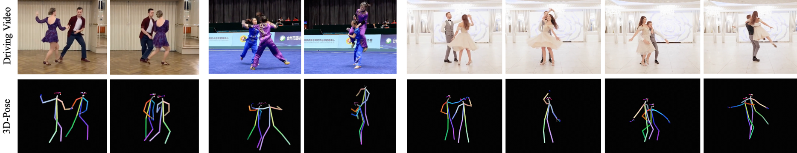
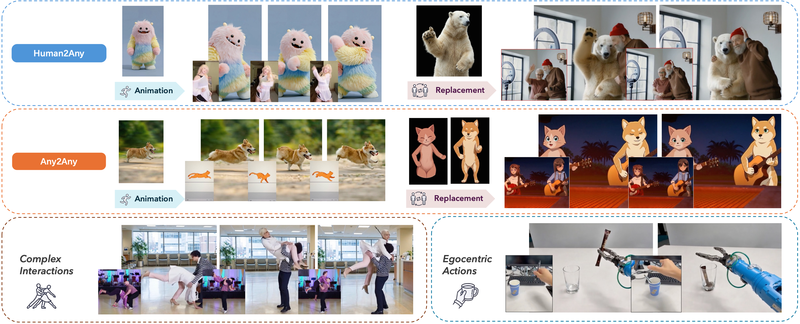
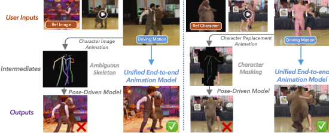
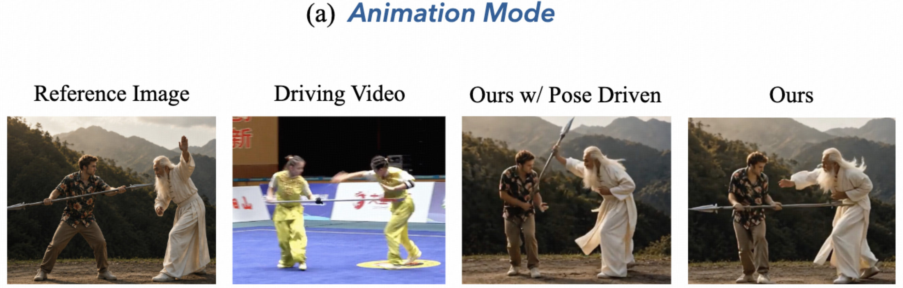

 <h1>Official Code for Processing Driving Videos for SCAIL Series</h1>
  <div align="center">
  <a href='https://arxiv.org/abs/2512.05905'></a>
  <a href='https://teal024.github.io/SCAIL/'></a>
  <a href="https://github.com/zai-org/SCAIL">
    
  </a>
</div>


This repository contains the code to process driving videos for **SCAIL**, a series of frameworks towards Studio-Grade Character Animation via In-Context Learning. The frameworks enable complex animation under diverse and challenging
conditions, including large motion variations and multi-character interactions. The main repo is at [zai-org/SCAIL](https://github.com/zai-org/SCAIL).
<p align="center">
  <br>
  <b>SCAIL</b>
</p>

<p align="center">
  <br>
  <b>SCAIL-2</b>
</p>


## 📋 Methods
**SCAIL** is a series of frameworks towards Studio-Grade Character Animation via In-Context Learning. The first open-source work of this series is SCAIL-Preview, a pose-driven animation framework. We develop a 3D skeleton for the pose representation to be fully identity agnostic and depth-aware. The representation can process multi-human interactions, yielding robust results from [NLFPose](https://github.com/isarandi/nlf)’s reliable depth estimation.

<p align="center">
  
</p>

Despite current progress, skeleton maps suffer from inherent ambiguity under complex scenarios. As intermediates, skeleton maps suffer from inherent ambiguity under complex scenarios. Further, it restricts the driving source to be exocentric human movements and thus cannot handle driving sources like animals. Character replacement and multi-character animation suffers from similar issues, where state-of-the-art methods use inpainting masks, but such masks are still a form of intermediates and limits the application and bounds the performance.

<p align="center">
  
</p>

Our latest **SCAIL-2** is an end-to-end framework to bypass the pose estimation to obtain more reliable and expressive motion, utilizing the inherent in-context learning capability in the diffusion transformer. We adopt a unification design to support both Animation Mode and Replacement Mode, using
 [SAM3](https://github.com/facebookresearch/sam3) to extract the explicit mask for both the reference image and the driving sequence to augment the conditioning. Benefiting from the end-to-end unification, SCAIL-2 supports diverse driving tasks. You can directly use the full driving video to drive the reference image, or use pose-driven just like SCAIL-Preview. We will elaborate different ways of driving in lateral usage instructions.


## 🚀 Getting Started

Make sure you have already clone the main repo, this repo should be cloned under the main repo folder:
```
SCAIL/ (or SCAIL-2/)
├── examples
├── sat
├── configs
├── ...
├── SCAIL-Pose
```

Change dir to this pose extraction & rendering folder:

```
cd SCAIL-Pose/
```

### Environment Setup

We recommend using [mmpose](https://github.com/open-mmlab) for the environment setup. You can refer to the official
mmpose [installation guide](https://mmpose.readthedocs.io/en/latest/installation.html). Note that the example in the guide uses python 3.8, however we recommend using python>=3.10 for better compatibility with SAM models.
The following commands are used to install the required packages once you have setup the environment.

```bash
conda activate openmmlab
pip install -r requirements.txt

# [Optional] SAM2 is only for multi-human extraction of SCAIL-Preview, for SCAIL-2 we use SAM3
git clone https://github.com/facebookresearch/sam2.git && cd sam2
pip install -e .
cd checkpoints && \
./download_ckpts.sh && \
cd ../..
```


### Weights Download

First, download pretrained weights for pose extraction & rendering. The script below
downloads [NLFPose](https://github.com/isarandi/nlf) (torchscript), [DWPose](https://github.com/IDEA-Research/DWPose) (
onnx) and [YOLOX](https://github.com/Megvii-BaseDetection/YOLOX) (onnx) weights. You can also download the weights
manually and put them into the `pretrained_weights` folder.

```bash
mkdir pretrained_weights && cd pretrained_weights
# download NLFPose Model Weights
wget https://github.com/isarandi/nlf/releases/download/v0.3.2/nlf_l_multi_0.3.2.torchscript
# download DWPose Model Weights & Detection Model Weights
mkdir DWPose
wget -O DWPose/dw-ll_ucoco_384.onnx \
  https://huggingface.co/yzd-v/DWPose/resolve/main/dw-ll_ucoco_384.onnx
wget -O DWPose/yolox_l.onnx \
  https://huggingface.co/yzd-v/DWPose/resolve/main/yolox_l.onnx
cd ..
```

For **SCAIL-2**, you additionally need the SAM3 weights. SAM3 is gated on HuggingFace,
so you must first request access at [facebook/sam3](https://huggingface.co/facebook/sam3)
and agree to Meta's license. Once approved, download `sam3.pt` into `pretrained_weights/`:

```bash
# After being granted access on HuggingFace
huggingface-cli login
huggingface-cli download facebook/sam3 sam3.pt --local-dir pretrained_weights/
```

The weights should be formatted as follows:

```
pretrained_weights/
├── nlf_l_multi_0.3.2.torchscript
├── sam3.pt
└── DWPose/
    ├── dw-ll_ucoco_384.onnx
    └── yolox_l.onnx
```


## 🦾 Usage

### SCAIL-Preview

```
# Single Character w/o 3D Retarget
python NLFPoseExtract/v1_process_pose.py --subdir <path_to_the_example_pair> --resolution [512, 896]

# Single Character w/ 3D Retarget
python NLFPoseExtract/v1_process_pose.py --subdir <path_to_the_example_pair> --use_align --resolution [512, 896]

# Multi-Human
python NLFPoseExtract/v1_process_pose_multi.py --subdir <path_to_the_example_pair> --resolution [512, 896]
```

### SCAIL-2
For SCAIL-2, two entrypoints cover the two tasks: **Animation** (`process_animation_aio.py`) and **Replacement** (`process_replacement.py`).

#### Animation Mode

```bash
# (Recommended) End-to-end: rendered_v2.mp4 = driving copy, mask video is colored SAM3 masks.
# More accurate and easier than pose-driven for most cases.
python NLFPoseExtract/process_animation_aio.py --subdir <example_dir> --e2e_mode

# Pose-driven (no --e2e_mode): runs NLF + DWpose, rendered_v2.mp4 is the skeleton render.
# More interpretable / controllable; use it for extremely challenging inputs.
python NLFPoseExtract/process_animation_aio.py --subdir <example_dir>

## Following options allow behaviours between pose-driven and full-e2e. Useful for 704p horizontal / multi-human inputs where the zero-shot resolution gap causes artifacts

# E2E + per-frame mask silhouette crop. 
python NLFPoseExtract/process_animation_aio.py --subdir <example_dir> --e2e_mode --crop_e2e_mask

# E2E + per-frame bbox crop.
python NLFPoseExtract/process_animation_aio.py --subdir <example_dir> --e2e_mode --crop_e2e_bbox


```

Other useful flags: `--max_persons N` (default 2), `--text human character ...` (extra SAM3 prompts, e.g. add `"robot arm" "gripper"` for egocentric/robotic subjects), `--sam3_model <path>` (override the default `pretrained_weights/sam3.pt` location). The same `--sam3_model` flag is also accepted by `process_replacement.py`.

#### Replacement Mode

```bash
# Standard: ref image in the subdir, driving has 1 actor matching the ref.
python NLFPoseExtract/process_replacement.py --subdir <example_dir>

# Driving has 2 persons but you only want to replace 1: pick the driving track whose first-frame mask has
# highest IoU with the ref mask; drop the other.
python NLFPoseExtract/process_replacement.py --subdir <example_dir> --matchnearest
```

Examples are in the main repo folder; you can also use your own images or videos. After extraction the results live in the example folder and can be fed straight into the main repo to generate character animations.

#### Notes for Animation
Although our model supports a variety of driving modalities, end-to-end driving typically achieves the best results, as the model has access to the complete visual information. This is especially evident in cases involving object interactions.

<p align="center">
  
</p>


## 📄 Citation

If you find this work useful in your research, please cite:

```bibtex
@article{yan2025scail,
  title={SCAIL: Towards Studio-Grade Character Animation via In-Context Learning of 3D-Consistent Pose Representations},
  author={Yan, Wenhao and Ye, Sheng and Yang, Zhuoyi and Teng, Jiayan and Dong, ZhenHui and Wen, Kairui and Gu, Xiaotao and Liu, Yong-Jin and Tang, Jie},
  journal={arXiv preprint arXiv:2512.05905},
  year={2025}
}
```
